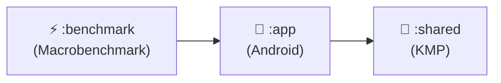

# ShowMate — Project Structure

> This file provides a high-level overview of the production codebase structure for recruiters and technical reviewers. The source code is proprietary and not included in this showcase repository.

```
ShowMate/
├── app/                              # Android Application Module
│   ├── src/main/
│   │   ├── java/com/andrea/showmateapp/
│   │   │   ├── di/                   # Koin DI Modules
│   │   │   │   ├── AppModule.kt
│   │   │   │   ├── NetworkModule.kt
│   │   │   │   ├── DatabaseModule.kt
│   │   │   │   └── ViewModelModule.kt
│   │   │   │
│   │   │   ├── data/                 # Data Layer
│   │   │   │   ├── local/
│   │   │   │   │   ├── dao/          # Room DAOs (UserDao, ShowDao, SyncActionDao...)
│   │   │   │   │   ├── entity/       # Room Entities
│   │   │   │   │   └── AppDatabase.kt
│   │   │   │   ├── remote/
│   │   │   │   │   ├── api/          # Ktor API Services (TmdbApi, OmdbApi)
│   │   │   │   │   ├── dto/          # Network DTOs
│   │   │   │   │   └── firebase/     # Firebase Services
│   │   │   │   ├── repository/       # Repository Implementations
│   │   │   │   └── mapper/           # Entity ↔ Domain Mappers
│   │   │   │
│   │   │   ├── presentation/         # Presentation Layer
│   │   │   │   ├── navigation/       # App Navigation Graph
│   │   │   │   ├── theme/            # ShowMate Design System (Colors, Typography, Shapes)
│   │   │   │   ├── components/       # Reusable Compose Components
│   │   │   │   ├── screens/
│   │   │   │   │   ├── home/         # Home/Discovery Screen
│   │   │   │   │   ├── detail/       # Show Detail Screen
│   │   │   │   │   ├── search/       # Search Screen
│   │   │   │   │   ├── profile/      # User Profile
│   │   │   │   │   ├── vault/        # The Legendary Vault
│   │   │   │   │   ├── cinemap/      # CineMap Screen
│   │   │   │   │   ├── social/       # Soulmate & Group Match
│   │   │   │   │   ├── graveyard/    # Graveyard of Shows
│   │   │   │   │   ├── stats/        # Statistics & Yearly Wrapped
│   │   │   │   │   ├── chat/         # AI Agent Chat
│   │   │   │   │   └── minigames/    # 18 Minigame Screens
│   │   │   │   │       ├── pixelpop/
│   │   │   │   │       ├── hangman/
│   │   │   │   │       ├── sixdegrees/
│   │   │   │   │       ├── boxoffice/
│   │   │   │   │       ├── soundtrack/
│   │   │   │   │       ├── casting/
│   │   │   │   │       ├── quote/
│   │   │   │   │       ├── timeweaver/
│   │   │   │   │       ├── twotruths/
│   │   │   │   │       ├── impostor/
│   │   │   │   │       ├── mixologist/
│   │   │   │   │       ├── oracle/
│   │   │   │   │       ├── emojiquiz/
│   │   │   │   │       ├── quiz/
│   │   │   │   │       ├── rewind/
│   │   │   │   │       ├── roulette/
│   │   │   │   │       ├── showdown/
│   │   │   │   │       └── tierlist/
│   │   │   │   └── viewmodel/        # ViewModels
│   │   │   │
│   │   │   ├── worker/               # WorkManager Workers
│   │   │   │   └── SyncWorker.kt     # Offline Sync Worker
│   │   │   │
│   │   │   └── util/                 # Android Utilities
│   │   │
│   │   └── res/                      # Android Resources
│   │
│   └── src/test/                     # Unit Tests (~500 tests)
│       └── java/com/andrea/showmateapp/
│           ├── viewmodel/            # ViewModel Tests
│           ├── repository/           # Repository Tests
│           └── screenshot/           # Roborazzi Screenshot Tests
│
├── shared/                           # KMP Shared Module (Pure Kotlin)
│   ├── src/commonMain/
│   │   └── kotlin/com/andrea/showmate/shared/
│   │       ├── domain/
│   │       │   ├── model/            # Domain Models (Show, UserProfile, ConsensusResult...)
│   │       │   └── usecase/
│   │       │       ├── GetRecommendationsUseCase.kt
│   │       │       ├── CalculateSoulmateConsensusUseCase.kt
│   │       │       ├── ChurnPredictor.kt
│   │       │       └── AchievementChecker.kt
│   │       └── engine/
│   │           └── RecommendationScoringEngine.kt
│   │
│   └── src/commonTest/              # KMP Tests (~85 tests)
│
├── benchmark/                        # Macrobenchmark Module
│   └── src/androidTest/
│       └── StartupBenchmark.kt
│
├── build.gradle.kts                  # Root Build Script
├── gradle.properties                 # Gradle Configuration
├── proguard-rules.pro               # ProGuard/R8 Rules
└── .github/
    └── workflows/
        └── ci.yml                    # GitHub Actions CI Pipeline
```

## Module Dependency Graph



## Key Metrics

- **Total Kotlin Files:** ~200+
- **Total Tests:** 586 (500 in `:app` + 85 in `:shared` + 1 benchmark)
- **Code Coverage (Kover):** Domain layer targets 90%+
