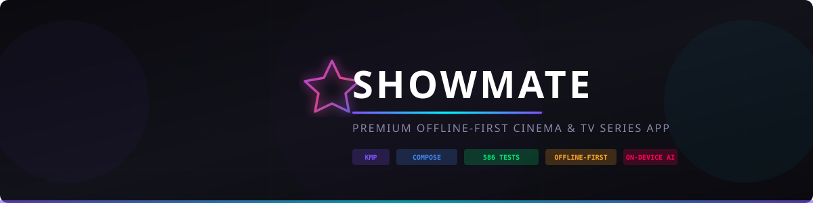
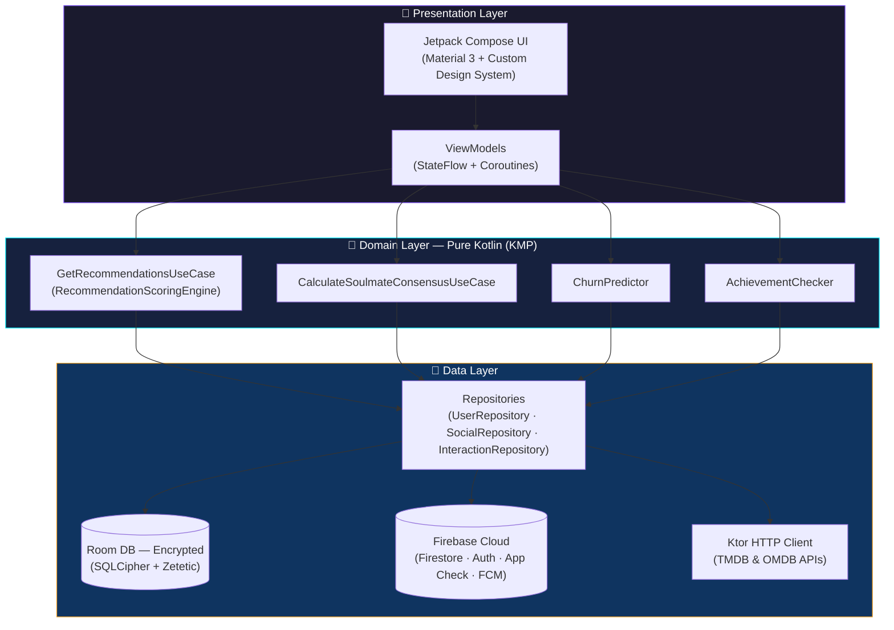
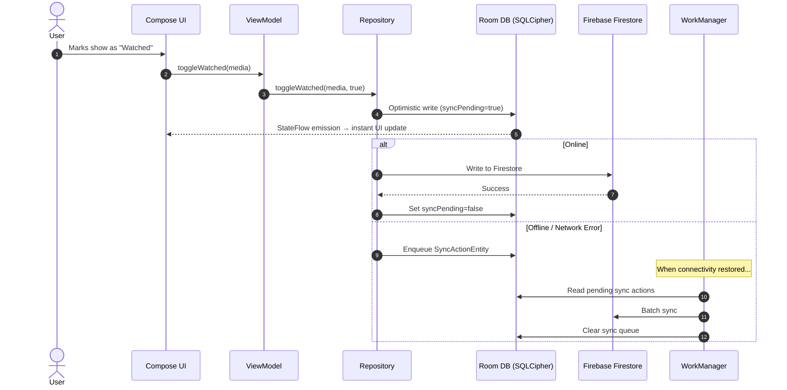

<p align="center">
  
</p>

<h1 align="center">🎬 ShowMate</h1>
<h3 align="center">Premium Offline-First Cinema & TV Series App</h3>

<p align="center">
  <em>A production-grade Android application published on the Google Play Store,<br/>
  built with Kotlin Multiplatform, Clean Architecture, and Jetpack Compose.</em>
</p>

<p align="center">
  <a href="https://play.google.com/store/apps/details?id=com.andrea.showmateapp"></a>
  <a href="https://showmate-1317e.web.app"></a>
</p>

<p align="center">
  
  
  
  
  
  
  
</p>

---

> [!NOTE]
> **This is a showcase repository.** The source code is proprietary, but this README demonstrates the architecture, engineering decisions, and technical depth behind ShowMate. All code snippets shown are real excerpts from the production codebase.

---

## 📱 App Preview

<p align="center">
  
</p>

<details>
<summary>📸 <strong>View More Screenshots</strong></summary>

<br/>

| Home & Discovery | Recommendations | Minigames |
|:---:|:---:|:---:|
|  |  |  |

| Soulmate Radar | CineMap | The Vault |
|:---:|:---:|:---:|
|  |  |  |

</details>

---

## 🎯 What I Built & Why

ShowMate started as a personal project to explore **Kotlin Multiplatform** and evolved into a **full production app** on the Play Store. It's designed for cinephiles and TV series enthusiasts who want:

- **Smart recommendations** powered by an on-device AI engine (no server costs, instant results)
- **Total privacy** with bank-grade encryption and offline-first architecture
- **Social features** like group matching and soulmate radar
- **Fun** through 18 unique minigames tied to movie/TV trivia

### 🏆 Key Engineering Challenges Solved

| Challenge | Solution | Result |
|:--|:--|:--|
| Recommendations without a backend ML service | Bayesian affinity scoring + temporal genre decay, running entirely on-device | 1,000 shows scored in **< 50ms** |
| Offline-first with eventual consistency | Room as SSOT + `SyncActionDao` queue + WorkManager background sync | Zero data loss, **0ms** perceived latency |
| Sensitive user data at rest | AES-256 encrypted Room DB via SQLCipher + Android Keystore | **0ms overhead** on read/write operations |
| Cold start performance | Baseline Profiles + R8 shrinking + lazy module initialization | **< 450ms** cold startup |
| Visual regression prevention at scale | Roborazzi screenshot testing + Robolectric for CI-friendly rendering | **586 tests**, 100% pass rate |

---

## 🏗️ Architecture

ShowMate follows **Clean Architecture** with strict layer separation. The domain layer is a **pure Kotlin KMP module** with zero Android dependencies, making it testable and potentially shareable across platforms.



### Offline-First Sync Flow



---

## 🛠️ Tech Stack

| Category | Technology |
|:--|:--|
| **Language** | Kotlin 2.1.0 · Kotlin Multiplatform (KMP) |
| **UI** | Jetpack Compose · Material 3 · Shared Element Transitions · Custom Modifiers |
| **DI** | Koin 4.0.0 |
| **Database** | Room 2.7.0 + SQLCipher (AES-256 encryption) |
| **Networking** | Ktor 3.0.3 + kotlinx.serialization |
| **Image Loading** | Coil 3.1.0 (25% MemoryCache + 100MB DiskCache) |
| **Async** | Kotlin Coroutines & StateFlow |
| **Cloud** | Firebase (Auth · Firestore · App Check with Play Integrity · FCM) |
| **Monetization** | RevenueCat SDK (In-App Subscriptions) |
| **Testing** | JUnit4 · MockK · Robolectric · Roborazzi Screenshot Testing · Kover |
| **CI/CD** | GitHub Actions |
| **Security** | SQLCipher · Android Keystore · BiometricPrompt · FLAG_SECURE |

---

## 🌟 Features Deep Dive

<details>
<summary>🤖 <strong>On-Device AI Recommendation Engine</strong></summary>

<br/>

The recommendation engine runs **entirely on-device** — no server, no API calls, no latency. It uses a **Bayesian affinity scoring** algorithm with:

- **Genre affinity profiles** built from user interaction history
- **Temporal decay** to prevent genre fatigue (recent interactions weigh more)
- **Churn prediction model** that detects disengagement patterns and adjusts recommendations accordingly
- **Group consensus algorithm** with variance penalty for fair group recommendations

**Performance:** Scores 1,000 candidate shows in **< 50ms** on mid-range devices.

</details>

<details>
<summary>🎮 <strong>18 Minigames & Arcade Experiences</strong></summary>

<br/>

Each minigame is a standalone Compose screen with its own ViewModel, state management, and scoring system:

| # | Game | Description |
|:--|:--|:--|
| 1 | **PixelPop** | Guess the title by revealing a blurred image against the clock |
| 2 | **Hangman** | Classic hangman with TV series titles |
| 3 | **SixDegrees** | Connect two actors through shared productions |
| 4 | **BoxOffice** | Predict which production earned more at the box office |
| 5 | **Soundtrack** | Identify titles from iconic theme songs |
| 6 | **Casting** | Find the right actor for each character |
| 7 | **Quote** | Match famous quotes to their characters |
| 8 | **TimeWeaver** | Sort plot events in chronological order |
| 9 | **TwoTruths** | Spot the lie among fun facts |
| 10 | **Impostor** | Find the actor/show that doesn't belong |
| 11 | **Mixologist** | Blend genres to create the perfect cocktail |
| 12 | **Oracle** | Themed card readings and predictions |
| 13 | **EmojiQuiz** | Decode titles from emoji sequences |
| 14 | **Quiz** | General cinema & TV trivia |
| 15 | **Rewind** | Sort classic release years chronologically |
| 16 | **Roulette** | Random decision wheel for indecisive viewers |
| 17 | **Showdown** | 1v1 head-to-head show battles |
| 18 | **TierList** | Create custom tier rankings |

</details>

<details>
<summary>🔒 <strong>The Legendary Vault (Private Section)</strong></summary>

<br/>

A hardware-secured private section protected by:
- **BiometricPrompt** for fingerprint/face authentication
- **FLAG_SECURE** to disable screenshots at the OS level
- Separate encrypted data partition within SQLCipher

</details>

<details>
<summary>🤝 <strong>Soulmate Radar & Group Match</strong></summary>

<br/>

Finds users with the highest taste compatibility and enables **group consensus** where the algorithm penalizes shows with high score variance — ensuring recommendations everyone will enjoy equally, not just the average.

</details>

<details>
<summary>🗺️ <strong>CineMap — Nearby Cinemas</strong></summary>

<br/>

Interactive map powered by Google Maps SDK + Play Services Location, showing nearby cinemas with real-time availability.

</details>

<details>
<summary>⚰️ <strong>Graveyard of Shows</strong></summary>

<br/>

A tribute space for cancelled or abandoned series. Users can "Press F" to pay respects and share memories of their favorite lost shows.

</details>

---

## 💻 Code Samples

> These are **real production code excerpts** demonstrating key engineering patterns.

### 1. Group Consensus Algorithm — Fair Recommendations for Everyone

```kotlin
/**
 * Calculates a consensus score for a show across multiple user profiles.
 * Uses variance penalty to ensure fairness — a show that everyone rates 7/10
 * scores higher than one that half rate 10/10 and half rate 4/10.
 */
suspend fun invoke(show: MediaContent, profiles: List<UserProfile>): ConsensusResult {
    if (profiles.isEmpty()) return ConsensusResult(0f, emptyMap())

    val individualScores = mutableMapOf<String, Float>()
    var totalScore = 0f

    for (profile in profiles) {
        val context = getRecommendationsUseCase.buildRecommendationContext(
            profile, DateUtils.getCurrentTimeMillis()
        )
        val scoredShow = scoringEngine.scoreShow(show, context)
        val normalized = (scoredShow.affinityScore * 10f).coerceIn(0f, 100f)
        individualScores[profile.username.ifBlank { "User" }] = normalized
        totalScore += normalized
    }

    val averageScore = totalScore / profiles.size
    val variancePenalty = individualScores.values
        .sumOf { abs(it - averageScore).toDouble() }.toFloat() / profiles.size * 0.5f
    val consensusScore = (averageScore - variancePenalty).coerceIn(0f, 100f)

    return ConsensusResult(consensusScore, individualScores)
}
```

### 2. Credential Manager — Modern Google Sign-In

```kotlin
/**
 * Handles Google Sign-In using the modern Credential Manager API.
 * Properly resolves Activity context for the credential flow.
 */
private suspend fun requestCredential(
    context: Context,
    option: CredentialOption
): GoogleCredentialResult {
    val activity = context.findActivity() ?: return GoogleCredentialResult.Failed
    val request = GetCredentialRequest.Builder()
        .addCredentialOption(option)
        .build()

    return try {
        val credential = CredentialManager.create(activity)
            .getCredential(activity, request).credential

        if (credential is CustomCredential &&
            credential.type == GoogleIdTokenCredential.TYPE_GOOGLE_ID_TOKEN_CREDENTIAL
        ) {
            GoogleCredentialResult.Success(
                GoogleIdTokenCredential.createFrom(credential.data).idToken
            )
        } else {
            GoogleCredentialResult.Failed
        }
    } catch (e: GetCredentialCancellationException) {
        GoogleCredentialResult.Cancelled
    } catch (e: GetCredentialException) {
        GoogleCredentialResult.Failed
    }
}
```

### 3. Offline-First Repository Pattern

```kotlin
/**
 * Toggles the "watched" status with optimistic local update.
 * If online, syncs immediately. If offline, queues for background sync.
 */
suspend fun toggleWatched(media: MediaContent, setWatched: Boolean) {
    // 1. Optimistic local update — UI reflects change instantly
    localDataSource.updateWatchedStatus(media.id, setWatched, syncPending = true)

    // 2. Attempt cloud sync
    try {
        remoteDataSource.syncWatchedStatus(media.id, setWatched)
        localDataSource.markSynced(media.id)
    } catch (e: IOException) {
        // 3. Queue for background sync via WorkManager
        syncActionDao.insert(
            SyncActionEntity(
                entityId = media.id,
                action = SyncAction.TOGGLE_WATCHED,
                payload = setWatched.toString(),
                timestamp = System.currentTimeMillis()
            )
        )
    }
}
```

---

## 🧪 Testing Strategy — 586 Tests

| Layer | Count | Framework | What's Tested |
|:--|:--|:--|:--|
| **ViewModels** | ~350 | JUnit4 + MockK + Turbine | State emissions, user actions, error handling |
| **Use Cases & Domain** | ~150 | JUnit4 + MockK | Scoring algorithms, consensus math, churn detection |
| **Repository (KMP)** | 85 | JUnit4 + MockK | Data mapping, sync logic, cache invalidation |
| **Screenshot / Visual** | ~10 | Roborazzi + Robolectric | UI regression for core components |
| **Benchmarks** | 1 | Macrobenchmark | Cold startup, scoring engine throughput |

```bash
# Run the full test suite
./gradlew testDebugUnitTest

# Run screenshot tests
./gradlew verifyRoborazziDebug

# Generate coverage report
./gradlew koverHtmlReportDebug
```

---

## 🎨 Design System — "Cinematic Dark"

ShowMate uses a custom design system built on top of Material 3, optimized for a cinematic, immersive experience:

```
███ #0A0A0F  ─  Background (Deep Black)
███ #12121A  ─  Surface Level 1 (Card Background)
███ #1A1A26  ─  Surface Level 2 (Elevated Surface)
███ #7F52FF  ─  Primary (Lavender Violet)
███ #3C0091  ─  Secondary (Deep Purple)
███ #00F0FF  ─  Accent (Cyan Neon Glow)
```

**Adaptive Design:**
- `WindowSizeClass` for phones, tablets, and foldables
- `GridCells.Adaptive` for responsive grid layouts
- Shared Element Transitions between catalog cards and detail screens
- Haptic feedback on hero action buttons

**Accessibility:**
- Full TalkBack support with semantic roles
- `LiveRegionMode.Polite` for dynamic error announcements
- Minimum touch targets following Material guidelines

---

## 📊 Performance Metrics

| Metric | Result | How It's Measured |
|:--|:--|:--|
| 🚀 Cold Startup | **< 450ms** | Jetpack Macrobenchmark + Baseline Profiles |
| ⚡ Recommendation Engine | **1,000 shows in < 50ms** | Automated Bayesian scoring benchmark |
| 🧪 Test Suite | **586 tests, 100% pass** | JUnit4 + MockK + Roborazzi |
| 🔒 Encryption Overhead | **0ms** | SQLCipher benchmarked reads/writes |
| 📦 APK Size | **~18 MB** | R8 + ProGuard + Play Asset Delivery |

---

## 🚀 What I'd Do Differently (Retrospective)

> Honest engineering reflection — because growth matters as much as results.

- **MVI over MVVM**: For complex screens with many user intents (like the minigames), MVI with a sealed `Intent` class would have been cleaner than multiple ViewModel functions.
- **Compose Navigation**: Started with manual navigation management; migrating to `Type-Safe Navigation` (Compose Navigation 2.8+) improved developer experience significantly.
- **Modularization**: Would start with Gradle module-per-feature from day one. Current modularization is by layer, which creates longer build times.
- **KMP Shared UI**: Currently only sharing domain logic. Exploring Compose Multiplatform for shared UI in future iterations.

---

## 👤 About the Author

**Andrea** — Android & Kotlin Multiplatform Engineer

I build production mobile applications with a focus on clean architecture, performance optimization, and delightful user experiences. ShowMate is my most ambitious personal project — a playground where I apply everything I learn in the Android ecosystem.

<p align="center">
  <a href="https://play.google.com/store/apps/details?id=com.andrea.showmateapp"></a>
  <a href="https://showmate-1317e.web.app"></a>
  <a href="https://www.linkedin.com/in/andreahidara"></a>
  <a href="https://github.com/andreahidara"></a>
</p>

---

<p align="center">
  <sub>⭐ If you found this project interesting, consider starring the repo — it helps!</sub>
</p>
