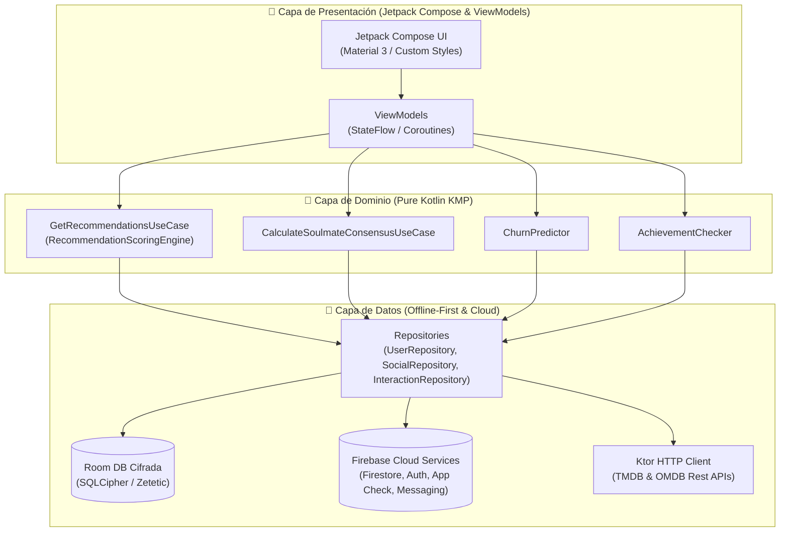
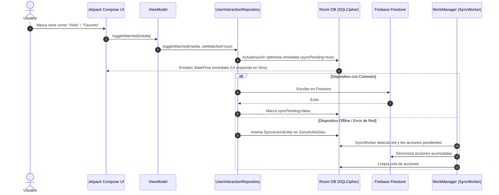

# 🎬 ShowMate — Premium Offline-First Cinema & TV Series App

[](https://play.google.com/store/apps/details?id=com.andrea.showmateapp)
[](https://kotlinlang.org/docs/multiplatform.html)
[](https://developer.android.com/jetpack/compose)
[](https://github.com/andreahidara/ShowMate/actions)
[](https://showmate.app)

**ShowMate** es una aplicación móvil de producción en la **Google Play Store**, construida bajo principios de **Kotlin Multiplatform (KMP)**, **Clean Architecture** y **MVVM**.

Combina un motor de recomendaciones por **IA On-Device**, sincronización **Offline-First**, cifrado de grado bancario (**SQLCipher + KeyStore**), **18 minijuegos y experiencias arcade**, agentes de chat IA, mapas de cines cercanos y funciones sociales de comunidad en tiempo real.

---

## ⚡ Métricas de Rendimiento & Calidad

| Métrica | Resultado | Método de Verificación |
| :--- | :--- | :--- |
| 🚀 **Arranque en Frío (*Cold Startup*)** | **< 450 ms** | Jetpack Macrobenchmark + Baseline Profiles |
| ⚡ **Motor de Recomendación** | **1,000 series en < 50 ms** | Benchmark automatizado de puntuación Bayesiana |
| 🧪 **Suite de Pruebas Automáticas** | **586 Tests (100% éxito)** | JUnit4, MockK, Roborazzi Screenshot Testing |
| 🔒 **Cifrado de Datos** | **AES-256 (0ms overhead)** | Room DB Cifrado con SQLCipher + Keystore System |
| 📦 **Tamaño del APK Base** | **~18 MB** | R8 Shrinking, ProGuard & Play Asset Delivery |

---

## 🎨 Sistema de Diseño UI & Experiencia de Usuario (UI / UX)

ShowMate implementa un sistema de diseño propio (*ShowMate Design System*) basado en **Material 3** y adaptado para una experiencia cinematográfica inmersiva:

### 🌌 Paleta de Colores "Cinematic Dark"
```
█ #0A0A0F  Fondo Principal (Background Dark)
█ #12121A  Superficie de Tarjetas (Surface Level 1)
█ #1A1A26  Superficie Eleva (Surface Level 2)
█ #7F52FF  Color Primario (Lavender Violet)
█ #3C0091  Color Secundario (Deep Purple)
█ #00F0FF  Acento Neón (Cyan Glow)
```

### 📱 Diseño Adaptativo (*Adaptive Layouts*)
- **Layouts Flexibles**: Adaptación mediante `GridCells.Adaptive` e `WindowSizeClass` para smart-phones en vertical, horizontal y tablets de gran formato.
- **Micro-interacciones y Animaciones**:
  - Transiciones de elementos compartidos (*Shared Element Transitions*) entre las tarjetas del catálogo y la pantalla de detalles.
  - Efectos de Sheen estilo cristal y respuesta háptica en botones de acción héroe (`AuthPrimaryButton`).
  - Desenfoque dinámico (*Blur Radius Decay*) a contrarreloj en el minijuego *PixelPop*.
- **Accesibilidad y Semántica**:
  - Componentes etiquetados para lectores de pantalla (`TalkBack`) con semántica de roles y anuncios dinámicos de errores (`LiveRegionMode.Polite`).

---

## 🌟 Características Principales

- 🎬 **Motor de Recomendaciones por IA On-Device**: Algoritmo de afinidad bayesiana, atenuación temporal de géneros y modelo probabilístico de predicción de abandono (*Churn Predictor*).
- 🔒 **Bóveda Privada (*The Legendary Vault*)**: Sección protegida con autenticación biométrica (`BiometricPrompt`) y captura de pantalla deshabilitada por hardware (`FLAG_SECURE`).
- 🎮 **18 Minijuegos y Experiencias Arcade**:
  1. **PixelPop**: Adivina el título revelando la imagen desenfocada a contrarreloj.
  2. **Ahorcado Seriéfilo (*Hangman*)**: Descubre la serie antes de agotar los intentos.
  3. **6 Grados de Separación (*SixDegrees*)**: Conecta dos actores mediante sus producciones compartidas.
  4. **Predicción de Taquilla (*BoxOffice*)**: Estima cuál producción recaudó más en cines.
  5. **Banda Sonora (*Soundtrack*)**: Adivina el título a partir de temas musicales icónicos.
  6. **Director de Casting (*Casting*)**: Encuentra al actor correcto para cada personaje.
  7. **Frases Míticas (*Quote*)**: Relaciona citas famosas con sus personajes.
  8. **Tejedor del Tiempo (*TimeWeaver*)**: Ordena eventos clave de la trama en la línea temporal.
  9. **2 Verdades y 1 Mentira (*TwoTruths*)**: Identifica el dato falso entre curiosidades.
  10. **El Impostor (*Impostor*)**: Encuentra al actor o serie que no pertenece al grupo.
  11. **El Cóctel Seriéfilo (*Mixologist*)**: Mezcla ingredientes y géneros para crear la bebida perfecta.
  12. **El Oráculo Seriéfilo (*Oracle*)**: Predicciones y lecturas de cartas temáticas.
  13. **Adivina por Emojis (*EmojiQuiz*)**: Descifra títulos a través de secuencias de emojis.
  14. **Trivia General (*Quiz*)**: Preguntas de cultura general de cine y televisión.
  15. **Rewind Cronológico (*Rewind*)**: Ordena años de lanzamiento de clásicos.
  16. **Ruleta de Decisiones (*Roulette*)**: Elección aleatoria cuando no sabes qué ver.
  17. **Duelo 1v1 (*Showdown*)**: Enfrentamientos cara a cara de series.
  18. **Creador de Tier Lists (*TierList*)**: Clasifica producciones en rangos personalizados.
- 🤝 **Radar de Alma Gemela & Match de Grupos**: Algoritmo de consenso de grupos con penalización por varianza para encontrar títulos que agraden a todos por igual.
- 🗺️ **CineMap**: Mapa interactivo de cines cercanos integrado con Play Services y Google Maps.
- 🤖 **Agente de Chat IA (*AgentChat*)**: Asistente en el dispositivo para recomendaciones personalizadas.
- ⚰️ **Cementerio de Series (*Graveyard*)**: Espacio para rendir tributos (*Press F*) a series canceladas o abandonadas.
- 📴 **Offline-First & Sincronización en Segundo Plano**: Persistencia en Room con cola de acciones pendientes (`SyncActionDao`) sincronizadas mediante **WorkManager**.
- 📊 **Estadísticas Avanzadas & Resumen Anual (*Yearly Wrapped*)**: Gráficas de horas vistas, géneros favoritos y tarjetas generadas para compartir en redes sociales.

---

## 🏗️ Arquitectura & Diagrama de Secuencia

### Diagrama de Capas (Clean Architecture)



### Diagrama de Secuencia: Flujo de Sincronización Offline-First



---

## 🛠️ Stack Tecnológico

| Categoria | Tecnología / Librería |
| :--- | :--- |
| **Lenguaje** | Kotlin 2.1.0 / Kotlin Multiplatform (KMP) |
| **UI Framework** | Jetpack Compose (Material 3, Shared Element Transitions, Custom Modifiers) |
| **Inyección de Dependencias** | Koin 4.0.0 |
| **Base de Datos** | Room 2.7.0 + SQLCipher (Encriptación AES-256) |
| **Networking & Serialización** | Ktor 3.0.3 + kotlinx.serialization |
| **Carga de Imágenes** | Coil 3.1.0 (25% MemoryCache + 100MB DiskCache) |
| **Asincronía** | Kotlin Coroutines & StateFlow |
| **Cloud Services** | Firebase (Auth, Firestore, App Check con Play Integrity, Messaging) |
| **Monetización** | RevenueCat SDK (Suscripciones In-App) |
| **Testing & CI/CD** | JUnit4, MockK, Robolectric, Roborazzi Screenshot Testing, Kover, GitHub Actions |

---

## 🧪 Calidad de Código & Testing (586 Tests)

ShowMate cuenta con una suite de pruebas automatizadas que se ejecuta en cada *commit* mediante **GitHub Actions**:

- 🟢 **Pruebas Unitarias de ViewModels & Dominio**: 500 tests en `:app`
- 🟢 **Pruebas de Repositorios KMP**: 85 tests en `:shared`
- ⚡ **Benchmark de Rendimiento**: Evaluación de puntuación de 1,000 candidatas en **< 50 ms**.
- 📸 **Screenshot Testing Visual**: Capturas automáticas con **Roborazzi** y **Robolectric** para componentes UI (`AuthComponents`, `ShowCard`, `UiStateHandler`).

```powershell
# Ejecutar la suite completa de pruebas
./gradlew testDebugUnitTest
```

---

## 💻 Extractos de Código Destacados

### 1. Algoritmo de Consenso de Grupo (Equidad en Recomendaciones)

```kotlin
suspend fun invoke(show: MediaContent, profiles: List<UserProfile>): ConsensusResult {
    if (profiles.isEmpty()) return ConsensusResult(0f, emptyMap())

    val individualScores = mutableMapOf<String, Float>()
    var totalScore = 0f

    for (profile in profiles) {
        val context = getRecommendationsUseCase.buildRecommendationContext(profile, DateUtils.getCurrentTimeMillis())
        val scoredShow = scoringEngine.scoreShow(show, context)
        val normalized = (scoredShow.affinityScore * 10f).coerceIn(0f, 100f)
        individualScores[profile.username.ifBlank { "Usuario" }] = normalized
        totalScore += normalized
    }

    val averageScore = totalScore / profiles.size
    val variancePenalty = individualScores.values.sumOf { abs(it - averageScore).toDouble() }.toFloat() / profiles.size * 0.5f
    val consensusScore = (averageScore - variancePenalty).coerceIn(0f, 100f)

    return ConsensusResult(consensusScore, individualScores)
}
```

### 2. Autenticación Segura con Credential Manager y Activity Context

```kotlin
private suspend fun requestCredential(context: Context, option: CredentialOption): GoogleCredentialResult {
    val activity = context.findActivity() ?: return GoogleCredentialResult.Failed
    val request = GetCredentialRequest.Builder().addCredentialOption(option).build()
    return try {
        val credential = CredentialManager.create(activity).getCredential(activity, request).credential
        if (credential is CustomCredential && credential.type == GoogleIdTokenCredential.TYPE_GOOGLE_ID_TOKEN_CREDENTIAL) {
            GoogleCredentialResult.Success(GoogleIdTokenCredential.createFrom(credential.data).idToken)
        } else {
            GoogleCredentialResult.Failed
        }
    } catch (e: GetCredentialCancellationException) {
        GoogleCredentialResult.Cancelled
    } catch (e: GetCredentialException) {
        GoogleCredentialResult.Failed
    }
}
```

---

## 👤 Autor & Contacto

Desarrollado con ❤️ por **Andrea** — Android & Kotlin Multiplatform Engineer.

- 📱 **App en Google Play**: [ShowMate en Play Store](https://play.google.com/store/apps/details?id=com.andrea.showmateapp)
- 🌐 **Sitio Web Oficial**: [showmate-1317e.web.app](https://showmate-1317e.web.app) | [showmate.app](https://showmate.app)
